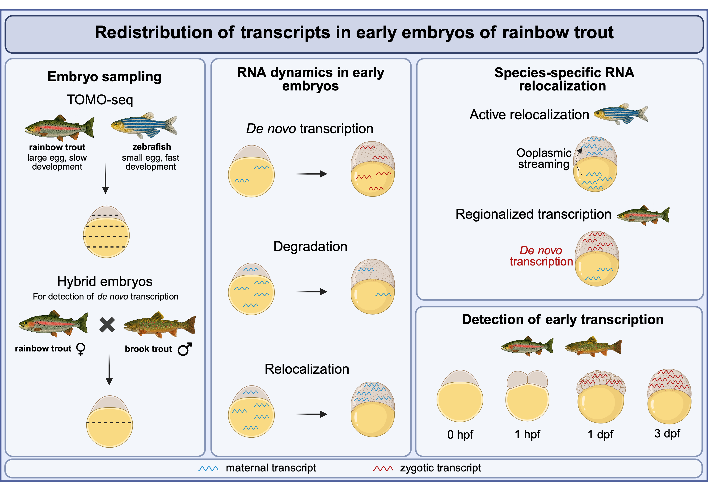

# Analysis of Transcripts During Early Trout Development

  

This repository contains the analysis pipeline used in our study of early embryonic development in rainbow trout (*Oncorhynchus mykiss*) and zebrafish (*Danio rerio*). The primary focus is on **TOMO-seq** (tomographic RNA sequencing), applied to three experimental datasets spanning the freshly fertilized egg to the early blastula stage. The github layout and code workflow has been optimized with the help of ChatGPT to improve readability

**Publication**: **"RNA redistribution driven by alterations in transcription during early embryogenesis of rainbow trout"** (*Journal name*, YYYY) – [link to article](https://blahblah.blah).

The analysis is based on TOMO-seq across multiple experiments involving early embryonic stages:

1. **Trout TOMO-seq**: *O. mykiss* – 0 hpf (freshly fertilized egg/zygote), 1 hpf (early cleavage stage), 1 dpf (early blastula stage, ~32-64 cells), and 3 dpf (mid-blastula, ~1000 cells) 
2. **Trout-hybrid TOMO-seq**: *O. mykiss* egg fertilized with *Salvelinus fontinalis* sperm – 0 hpf (freshly fertilized egg/zygote), 1 hpf (early cleavage stage), 1 dpf (early blastula stage, ~32-64 cells), and 3 dpf (mid-blastula, ~1000 cells) 
3. **Zebrafish TOMO-seq**: *Danio rerio* – 1 hpf (~4-cell), 2 hpf (~64-cell), and 3 hpf (~1000-cell) stages

---

## 🔎 Interactive Data Exploration

Explore spatial and temporal gene expression dynamics using our interactive [`flexdashboard`](flexdashboard/).

📋 Features:
1.  Visualize normalized gene expression across embryonic stages and spatial sections
2.  Search by gene symbols from *O. mykiss*, *S. fontinalis*, *D. rerio*
3.  Cross-species ortholog mapping of differentially localized transcripts (DLTs)
4.  Genome-specific profiles for hybrid trout (*genome1* = *O. mykiss*, *genome2* = *S. fontinalis*)

  

🚀 How to use:
1.  Download the `flexdashboard/` folder
2.  Open the `.Rmd` file in RStudio
3.  Install required R packages
4.  Set the `folder_path` to qs2 file

🔍 Use `gene_id` to search for genes and visualize expression patterns.

---

## 💾 Data Availability

Raw sequencing data for all experiments are publicly available at NCBI GEO:
Super series: [GSE304790](https://www.ncbi.nlm.nih.gov/geo/query/acc.cgi?acc=GSE304790)
- **Trout TOMO-seq**: [GSE304715](https://www.ncbi.nlm.nih.gov/geo/query/acc.cgi?acc=GSE304715)  
- **Trout-hybrid TOMO-seq**: [GSE304716](https://www.ncbi.nlm.nih.gov/geo/query/acc.cgi?acc=GSE304716)  
- **Zebrafish TOMO-seq**: [GSE304717](https://www.ncbi.nlm.nih.gov/geo/query/acc.cgi?acc=GSE304717)

---

## 🐟 Trout TOMO-seq Pipeline

📂 Scripts available in [`codebase`](codebase/).

Most required package versions are tracked via 'renv.lock'.
To recreate the environment copy the supplied 'renv.lock' to your working folder followed by:
renv::restore()

  
<code><strong>01 FastQ Preprocessing</strong></code>

  **Objective**: Preprocess FastQ reads by removing low-quality reads, mapping to the reference genome, and quantifying transcript counts.

  - [Script workflow](codebase/01_FastQ_Preprocessing.Rmd)
  - Import FastQ  
  - Quality control (*fastqc*)  
  - Adaptor trimming (*fastp*)  
  - rRNA filter (*RiboDetector*)  
  - mtDNA filter (*sortmerna*)  
  - Alignment (*STAR*)  
  - Transcript counting (*htseq-count*)  

  
<code><strong>02 Differential Analysis</strong></code>

  **Objective**: Identify differentially localized transcripts (DLTs) across sections within and between stages.

  - [Script workflow](codebase/02_Differential_Analysis.Rmd)
  - Import count data  
  - Normalize counts using *DESeq2* 
  - Perform differential analysis (*DESeq2*)  
  - Filter significant transcripts (DLTs):  
    - *padj* < 0.01  

 

  
<code><strong>03 TrendCatcher</strong></code>

  **Objective**: Additional method to identify section-specific expression trends across development.

  - [Script workflow](codebase/03_TrendCatcher.Rmd)
  - Import normalized DLT counts  
  - Identify trends using *trendcatcher*  
  - Filter significant transcripts (DLTs):  
    - *padj* < 0.01  
    - Minimum 100-count difference between conditions  

 

  
<code><strong>04 Identify Unique Clusters</strong></code>

  **Objective**: Identify spatially or temporally co-localized gene clusters.

  - [Script workflow](codebase/04_Identify_Unique_Clusters.Rmd)
  - Import normalized DLT counts  
  - Filter DLTs: normalized count > 20 in ≥1 stage  
  - Rule-based classification of profiles  
  - Import variance stabilization transformation (VST) of DLTs  
  - Cluster VST-transformed genes (*DEGReport*)  
  - Build summary DLT report table (summarized expression, profiles)  

  
<code><strong>05 Orthology</strong></code>

  **Objective**: Map DLTs to zebrafish or human gene symbols.

  - [Script workflow](codebase/05_Orthology.Rmd)
  - Import DLT report table  
  - Extract protein sequence of DLTs  
  - Protein similarity (via *Proteinortho*)  
  - Integrate ortholog information from *NCBI*, *Ensembl BioMart*, and *orthogene*  
  - Add orthologous reference gene symbols to DLT report table  

  
<code><strong>06 Ligand–Receptor</strong></code>

  **Objective**: Analyze spatial ligand–receptor interactions between extreme animal and vegetal poles.

  - Identify DLTs and orthologs specific to animal/vegetal poles [`Script workflow`](codebase/06_Ligand–Receptor_parta.Rmd)
  - Match ligands and receptors using *DanioTalk* [`Script workflow`](codebase/06_Ligand–Receptor_partb.Rmd) 
  - Visualize interactions using chord diagrams [`Script workflow`](codebase/06_Ligand–Receptor_partc.Rmd)

  
<code><strong>07 Gene Ontology (GO) and Pathway enrichment</strong></code>

  **Objective**: Identify enriched GO terms and pathway activities for gene clusters.

  - [Script workflow](codebase/07_Gene_Ontology_(GO)_and_Pathway_enrichment.Rmd)
  - Import DLT report table  
  - Anchor genes to zebrafish orthologs  
  - Perform GO enrichment using *gprofiler2* and *goCompass*  
  - Estimate pathway activity changes with *decoupleR*  

  

  
<code><strong>08 Regulons</strong></code>

  **Objective**: Detect transcription factors and their targets active across stages and sections.

  - [Script workflow](codebase/08_Regulons.Rmd)
  - Import DLT report table  
  - Anchor to zebrafish orthologs  
  - Compute gene regulatory networks using *SCENIC*
  - Identify and score regulons (TF–target modules) using *SCENIC*  

---

## 📊 Manuscript figures

This section contains the R code used to generate the figures for our manuscript, **"RNA redistribution driven by alterations in transcription during early embryogenesis of rainbow trout"** (*Journal name*, YYYY).

📂 Scripts available in [`manuscript_figures`](manuscript_figures/).
